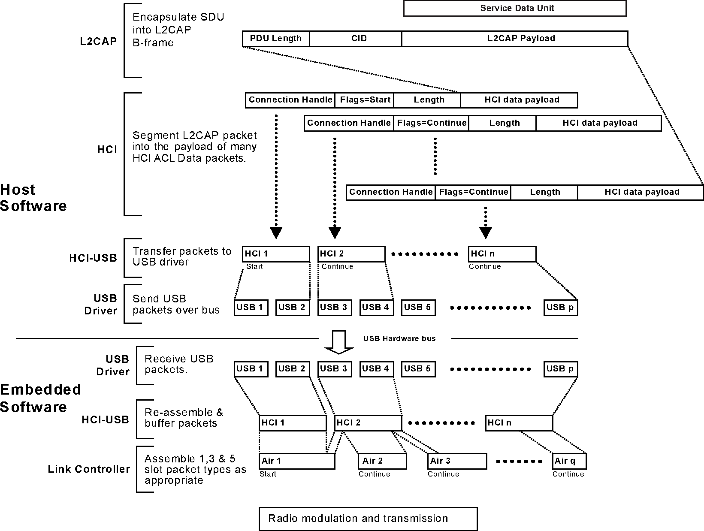

# Examples

The example logic can be found in the `app` directory.
The different target directories contain the required setup code for the different targets.
Any target specific documentation can be found in the respective target directory.

## High throughput examples

The high throughput examples showcase optimum configuration settings for achieving high throughput. 
Throughput of around 1.4 MBit/s have been measured with some of the more aggressive configurations.  
It is important to note that these configurations compromise on energy conservation.

These examples require specific hardware and HCI firmware configurations that can support the configurations used.
Any specific target requirements will be outlined is this readme.

### The configurations and their effects

Here we will look at some of the configurations that can be used to achieve high a throughput, 
their effects and how to set them.

#### Theoretical background

In order to understand what configurations need to be set and how, we will require some understanding of the Bluetooth hardware and lower layers of the software stack.

A Bluetooth controller, the actual physical radio, sends packets of data called the Protocol Data Unit (PDU).
In Bluetooth communication, there are a number of different PDUs used with different physical channels for different
purposes such as advertising and data transfer. These PDUs have different structures.
For our example, we only need to focus on the [Data Physical Channel PDU](https://www.bluetooth.com/wp-content/uploads/Files/Specification/HTML/Core-54/out/en/low-energy-controller/link-layer-specification.html#UUID-bdffe63c-9d5a-e80c-b833-1bec7946f005).
As the name suggests, this is used in the transfer of data.
The structure of the Data Physical Channel PDU is shown below.

Since Bluetooth 4.2, the maximum size of the PDU payload, plus the MIC if included, has increased from 27 to 251 bytes.
The maximum size of the PDU to be used in a connection, also known as the Maximum Transmission Unit (MTU), is negotiated. 
The length of this payload is described in the PDU header.

A data physical channel PDU payload can be a Logic Link (LL) Data PDU or a LL Control PDU.
These are differentiated by the LLID header bits.
For the purpose of these examples, we shall focus further on the LL data PDU. 
The payload of an LL data PDU contains Logical Link Control and Adaptation Protocol (L2CAP) data.

In a [connection oriented channel](https://www.bluetooth.com/wp-content/uploads/Files/Specification/HTML/Core-54/out/en/host/logical-link-control-and-adaptation-protocol-specification.html#UUID-3ec8360b-1e1c-07fa-7a2b-27eef555dda0), which is the case for these examples, the L2CAP data has the following structure. 

The L2CAP PDU length describes the length of the information payload.
The maximum size of the information payload is 65533.
This limit setting is known as the L2CAP MTU.
Notably, this can be larger than the maximum size of the PDU payload.
L2CAP payloads larger than the maximum size of the PDU payload will be fragmented by the MTU before sent over the air.

The primary objective of Bluetooth Low Energy (BLE) is energy conservation.
BLE achieves this by having the radio switched off for the majority of the time.
For example, once an isochronous connection is established to transfer data, the central and peripheral radios 
are switched on at the negotiated isochronous interval, also known as the connection interval.
During a connection event, data packets are exchanged between the central and peripheral, then the radios are switched off until the next connection event.

The primary goal of Bluetooth Low Energy (BLE) is to minimize energy consumption.
BLE achieves this efficiency by keeping the radio off for the majority of the time, and only activating it when necessary.
For instance, after a connection is established, data transfer occurs periodically during synchronized time windows called connection events.
These events are separated by a negotiated time interval known as the connection interval.
During each connection event, the central and peripheral radios briefly wake up to exchange data packets and then return to an idle state until the next event.
This scheduled radio activity significantly reduces power usage compared to keeping the radio active continuously.

Since Bluetooth 5.0, Bluetooth controllers can half the time required to send the same information.
This is called 2M PHY, as opposed to 1M PHY.
This allows the radio to send data quicker and spend more time sleeping.

By understanding these configurations, we can now modify them to forgo the objective of energy conservation in favour of maximising throughput.
The following sections describe how these configurations can be modified to maximise throughput.

#### HCI controller configuration

The maximum number of fragments an L2CAP PDU can be broken into may be limited by the HCI firmware.
For example, in the serial-hci example, the HCI UART Bluetooth dongle firmware's default has 3 buffers 
of the maximum PDU payload, which is set to 27 bytes by default.
Hence, L2CAP PDUs grater than $ 27 \times 3 $ cannot be handled by the HCI firmware.
These firmware configurations may be improved.
If this is required for your target, check the target's example readme for more information on how to do this. 

To calculate the maximum user data that can sent per L2CAP PDU, i.e. when calling the `channel.send` method,
we need to calculate the maximum size of the L2CAP PDU, 65533 or as limited by the controller firmware,
and understand what space will be consumed by the L2CAP headers.

// todo when are the L2CAP headers repeated?

#### The default settings

In the simple `ble_l2cap` example, using the default HCI UART example, the maximum amount of 

